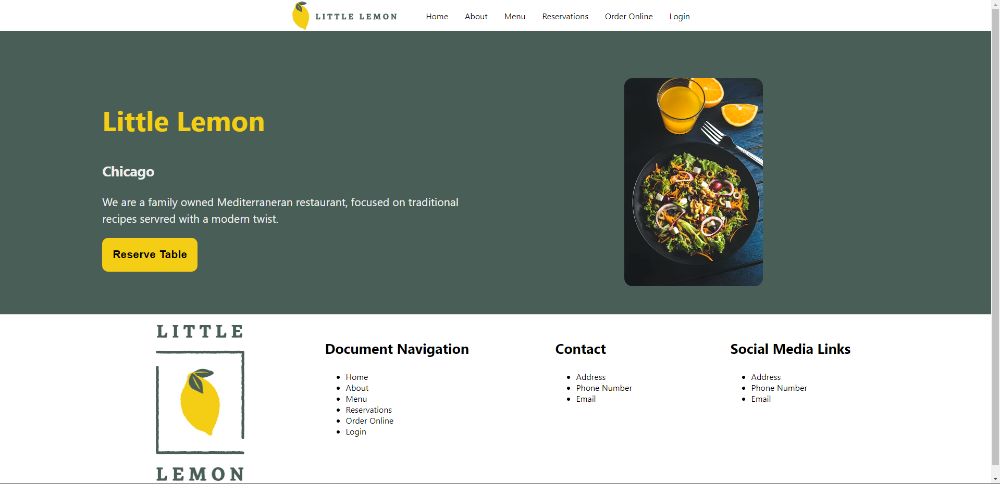
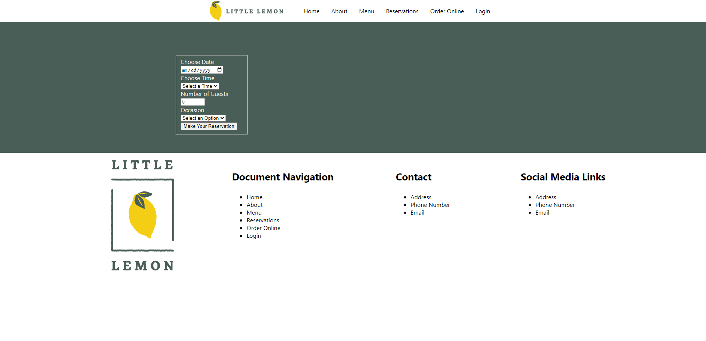
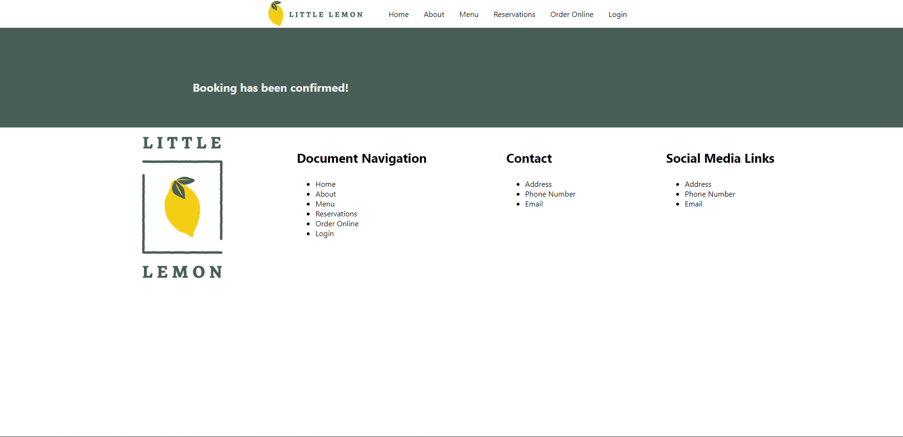

# Little Lemon Booking System

This project is a Django-based back-end system for the Little Lemon restaurant booking form. It allows users to make reservations, view available slots, and prevent duplicate bookings for specific date and time combinations.

## Author
> Ayoub Ghiouani

## Screenshots

Below are some screenshots of the application:



*Booking form page*



*Booking form showing date picker*



*Booked slots shown as greyed-out*

## Project Structure

- **Project Directory**: `littlelemon`
- **App Name**: `restaurant`

## Features

- Booking form with fields for first name, reservation date, and reservation slot.
- Date picker for selecting the reservation date.
- Prevention of duplicate bookings for the same date and time.
- Dynamic refresh of booking data when the date is changed.
- Display of "No Booking" message when no reservations are available.
- API endpoint for fetching bookings as JSON data.
- Fetch API used for retrieving data in the front-end.

## Setup Instructions

1. **Create Virtual Environment and Install Dependencies**
    ```bash
    pipenv shell
    pipenv install
    ```

2. **Run Migrations**
    ```bash
    python manage.py makemigrations
    python manage.py migrate
    ```

3. **Start the Development Server**
    ```bash
    python manage.py runserver
    ```

4. **Navigate to the booking page**
   - Go to `http://127.0.0.1:8000/` to use the booking form.

## Dependencies

- Django
- MySQL (Configured in `settings.py`)
- Pipenv for managing virtual environments

